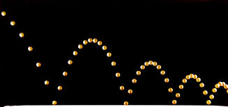

# bouncing-ball
<!DOCTYPE html PUBLIC "-//W3C//DTD HTML 4.0 Transitional//EN">
<html>
<head>
  <title>Assignment 1</title>
  <meta content="Microsoft FrontPage 6.0" name="GENERATOR">
  <meta http-equiv="Content-Type" content="text/html; charset=windows-1252">
</head>
<body bgcolor="#ffffff">
  <h3 style="font-family: Arial;">
    <big></big>
    

      <big><b><big>COMP 410/510, Computer Graphics, Spring 2023</big></b></big>
    

    <big></big>
  </h3>
  <h3 style="text-align: center;">
    
  </h3>
  <h3>
    

      <b> </b>
    

  </h3>
  <h3 style="font-family: Arial;">
    Due Date: Sunday, April 2, 2023
  </h3>
  <h3 style="font-family: Arial;">Problem Description and Learning Objectives:</h3>
  
    In this assignment, you will design and implement a basic graphics application that animates a ball bouncing horizontally on the screen (as shown above). This will be an interactive program that allows the user to select an object to draw (from a choice of two objects), to choose various drawing attributes for the object (such as color and polygon mode). Each time the user selects one of the drawing options, the image on the screen will be redrawn with the new choice. To develop this program you will need to learn how to use both shader-based OpenGL and GLFW 3D graphics libraries. The GLFW library includes functions for implementing event-driven input and display handling operations. This assignment will be an introduction to event-driven graphics programming. Your program must be developed using shader-based OpenGL and C/C++. 
     
    <ul></ul>
    <h3 style="font-family: Arial;">Problem Specification</h3>
    
Your program will simulate and display a bouncing ball (either cubical or spherical) under gravitational force. The ball will initially be placed on the top leftmost of the display window and then will start its fall (accelerated with gravity). The initial (horizontal) velocity will be a parameter to set. The ball will move rightwards with proper acceleration until it hits the bottom of the window, and bounce back slowing down gradually with each hit until it goes out of the window or its velocity becomes zero. Bouncing will continue as such. You may reduce the velocity by a fixed factor after each bouncing. During execution, the user may change the object type, color, and drawing mode.

    You can refer to the following page for physics of a bouncing ball under gravity (Note that in this assignment we will be ignoring the deformation of the bouncing ball): <a style="font-family: Arial;" href="https://interestingengineering.com/what-are-the-physics-behind-bouncing-balls">bouncing ball</a> 
    
Your program must handle user input from the keyboard and mouse, and set the drawing modes as specified below:

    
Object type and drawing mode (wireframe or solid) must be set by using mouse button callback: 

    <ul style="font-family: Arial;">
      <li><b>Object type</b> -- set the current object to be drawn; switch between the following two choices, whenever right button is pressed:
        <ul>
          <li>cube</li>
          <li>sphere</li>
        </ul>
      </li>
      <li><b>Drawing mode</b> -- set how the triangles are drawn; switch between the following two choices, whenever left button is pressed:</li>
      <ul>
        <li>wireframe (i.e., as lines)</li>
        <li>solid mode</li>
      </ul>
    </ul>
     Object initialization, color setting, termination, and help functionalities should be controlled through keyboard callback as specified below:<br

